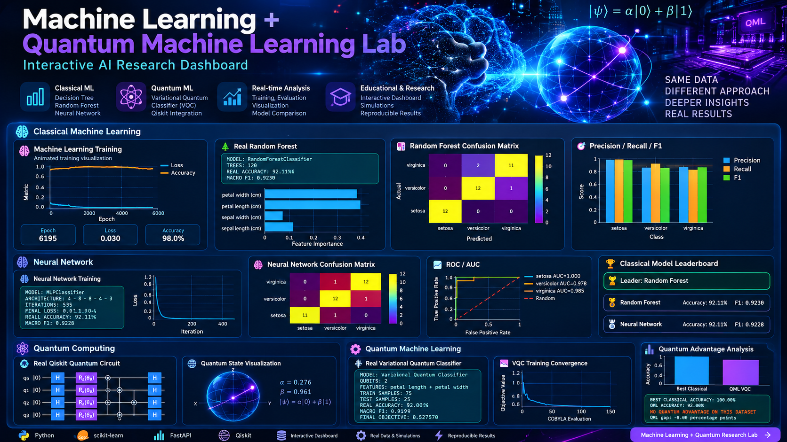

<p align="center">
  
</p>

<h1 align="center">Machine Learning + Quantum Machine Learning Lab</h1>

<p align="center">
  Interactive AI research dashboard combining <b>classical Machine Learning</b> and <b>Quantum Machine Learning</b>.
</p>

<p align="center">
  <b>Python</b> • <b>FastAPI</b> • <b>scikit-learn</b> • <b>Qiskit</b> • <b>Qiskit Machine Learning</b>
</p>

### Live Preview

<p align="center">
  
</p>

---

## Overview

The **Machine Learning + Quantum Machine Learning Lab** is an interactive research dashboard designed to explore, visualize, and compare classical machine learning and quantum machine learning approaches in one environment.

The project combines real model training, evaluation metrics, interactive visualizations, quantum circuits, and a validated Variational Quantum Classifier workflow.

---

## Core Features

### Classical Machine Learning

- Random Forest classification
- Neural Network classification with scikit-learn
- Live training-style metrics and visualizations
- Feature importance analysis
- Confusion matrices
- Precision, Recall, and F1 evaluation
- ROC / AUC analysis
- Classical model comparison
- Model leaderboard

---

## Quantum Computing

- Real Qiskit quantum circuit simulation
- Quantum state visualization
- Bloch sphere-style visualization
- Quantum circuit analysis
- Qubit state representation
- Quantum measurement simulation

---

## Quantum Machine Learning

### Variational Quantum Classifier

The project includes a real **Variational Quantum Classifier (VQC)** workflow using Qiskit Machine Learning.

The QML pipeline includes:

- ZZFeatureMap
- RealAmplitudes ansatz
- COBYLA optimizer
- Quantum feature encoding
- VQC training
- Training convergence history
- QML confusion matrix
- Accuracy evaluation
- Macro F1 evaluation
- Classical vs Quantum benchmark comparison

---

## QML Training Configuration

```text
Feature Map: ZZFeatureMap
Ansatz: RealAmplitudes
Optimizer: COBYLA
Qubits: 2
Training Samples: 75
Test Samples: 25
Optimization Evaluations: 150
